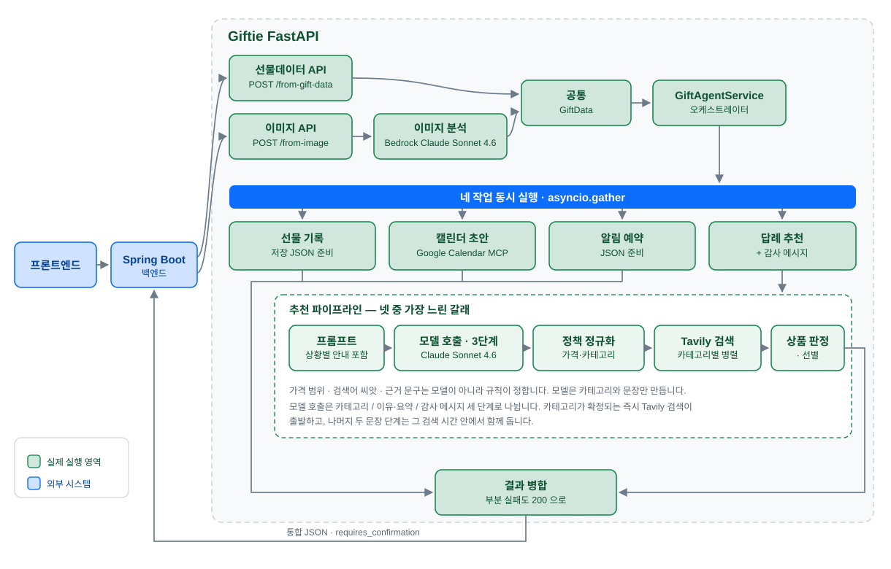
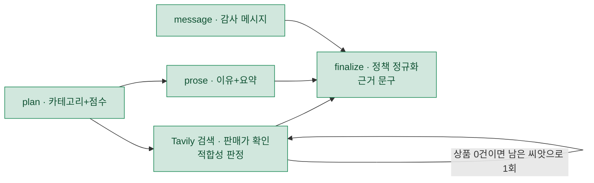

# Giftie AI Service

Giftie의 FastAPI 기반 AI 오케스트레이터입니다. Spring Boot 백엔드에서 선물데이터 또는 S3 이미지
주소를 받아 네 작업을 동시에 실행한 뒤 하나의 JSON으로 반환합니다.

1. 선물 기록 저장 데이터 준비
2. Google Calendar 등록 (준비 단계는 초안까지, 실제 등록은 `/confirm`)
3. 알림 예약 데이터 준비
4. 답례 상품 추천과 감사 메시지 준비

추천과 이미지 분석은 Amazon Bedrock의 Claude Sonnet 4.6을 씁니다. GPU도 모델 적재도 필요
없습니다. `MODEL_BACKEND` 로 vLLM(Gemma4-12B-QAT), MLX, Transformers, mock 으로 바꿀 수 있습니다.

## API 개요

| Method | Path | 입력 | 처리 |
|---|---|---|---|
| POST | `/api/v1/agent/from-gift-data` | 구조화된 선물데이터 | 네 작업을 바로 실행 |
| POST | `/api/v1/agent/from-image` | S3 이미지 URL | 이미지 분석 후 네 작업 실행 |
| POST | `/api/v1/agent/confirm` | 사용자 수정본 | 확정하고 캘린더에 실제 등록 |
| POST | `/api/v1/agent/recommend` | 나이·가격대·카테고리·성별 | 추천만 단독 실행 |

앞의 두 API는 캘린더에 등록하지 않고 초안까지만 만듭니다. 잘못 추출된 일정이 사용자 캘린더에
바로 박히면 되돌리기 어렵기 때문입니다. 실제 등록은 사용자가 확인 화면에서 검토·수정한 뒤
`/confirm` 에서 일어납니다.

```text
[준비]  POST /from-image  ->  네 작업 동시 실행  ->  응답(requires_confirmation=true)
                                                          |
                                              사용자가 확인 화면에서 검토·수정
                                                          |
[확정]  POST /confirm  ->  기록·알림 재계산 + Google Calendar 등록  ->  응답
```

AI 서비스는 상태를 보관하지 않습니다. 백엔드가 준비 응답을 들고 있다가 사용자 수정본과 함께
`/confirm` 으로 되돌려주면 됩니다.

## 처리 흐름



네 작업은 공통 `GiftData` 가 준비되는 즉시 `asyncio.gather(..., return_exceptions=True)` 로
동시에 시작합니다. 하나가 실패해도 나머지 결과는 유지하며 실패한 항목만 `ERROR` 가 됩니다.
넷 중 추천이 가장 느리므로 이 단계의 지연은 사실상 추천 지연입니다.

### 추천 파이프라인

모델은 **카테고리와 문장만** 만듭니다. 나머지는 규칙이 정합니다.

| 항목 | 누가 정하는가 |
|---|---|
| 추천 카테고리 (최대 3개), 이유, 요약, 감사 메시지 | 모델 |
| 검색 결과의 카테고리 적합성 | 모델. 후보 전체를 한 번에 묶어 1회 판정 |
| 답례 가격 범위 | 규칙. 받은 금액의 80~120%, 사용자 예산이 있으면 그대로 |
| 검색어 씨앗, `search_query` | 규칙. `SAFE_EXAMPLES` 표 |
| 상품 선별·가격 검증·근거 문구 | 규칙 |

카테고리 어휘는 백엔드가 저장하는 목록에 맞춰 다섯 개입니다 —
`디저트` · `꽃·식물` · `패션·잡화` · `상품권` · `생활용품`
(`recommendation_policy.SAFE_EXAMPLES`). 프롬프트가 이 목록을 싣고, 구조화 출력이
`enum` 으로 못박고, `normalize_recommendation` 이 목록 밖 값을 버립니다.

같은 목록을 이미지 기록의 분류(`gift_data_policy.normalize_record_category`)도 씁니다.
이쪽은 프롬프트로 강제하지 않습니다 — VLM 이 쓴 원문("기프티콘/음료")을 선물명 대체로
쓰는 자리가 있고, 조의금·축의금처럼 다섯 개 어디에도 속하지 않는 기록이 많기 때문입니다.
그래서 계약으로 나갈 때만 별칭·핵심어로 옮기고, 맞추지 못하면 원문을 그대로 내보내
백엔드가 스스로 "기타" 로 분류하게 둡니다.

모델 호출은 세 단계로 나뉘고, 실행 순서는 LangGraph 상태 그래프가 잡습니다
(`app/graph/recommendation_graph.py`). 상품 검색이 기다리는 것은 카테고리 **이름**뿐인데
한 번에 다 쓰면 감사 메시지까지 끝나야 검색이 출발하기 때문입니다.



- `message` 는 `plan` 과 동시에 출발합니다. 감사 메시지는 카테고리를 쓰지 않습니다 —
  프롬프트가 "답례는 아직 고르는 중이니 준비한다거나 주겠다는 말은 쓰지 말라"고 못박습니다.
- 예산과 카테고리가 둘 다 지정된 요청은 검색 조건이 모델 없이 확정되므로 검색이 `plan` 을
  기다리지 않고 t=0 에 출발합니다.
- **상품이 0건이면 아직 쓰지 않은 검색 씨앗으로 한 번 더 검색합니다.** 남은 시간이
  `TASK_TIMEOUT_SECONDS` 의 절반을 넘겼거나 쓸 씨앗이 없으면 시작하지 않습니다. 정상 경로의
  지연은 그대로입니다. `LANGGRAPH_SEARCH_RETRY=false` 로 끕니다.
- 세 호출은 각각 독립적으로 실패하고, 빈 자리는 정책 폴백이 채웁니다.
- Bedrock 전용입니다. 다른 백엔드나 `langgraph` 미설치 환경에서는 같은 세 호출을
  `asyncio` 로 엮은 경로(`RECOMMENDATION_SPLIT_CALLS`)로, 그마저 끄면 단일 호출로 내려갑니다.
  어느 경로든 프롬프트·정규화가 같아 응답은 동일합니다.

### 제한 시간

| 단계 | 설정 | 기본값 |
|---|---|---|
| `/from-image` 의 이미지 분석 | `IMAGE_ANALYSIS_TIMEOUT_SECONDS` | 45초 |
| 네 후속 작업과 `/recommend` | `TASK_TIMEOUT_SECONDS` | 30초 |

두 단계는 직렬이라 서버가 스스로 끊는 최악 지연은 **75초**입니다. 백엔드 HTTP 타임아웃을
90초로 잡으면 백엔드가 먼저 끊는 일이 없습니다. 넘기면 504(`UPSTREAM_TIMEOUT`)입니다.

실제 지연은 `/recommend` 기준 중앙값 8초 안팎입니다. 측정은 아래 스크립트로 합니다.

```bash
python scripts/benchmark_split.py --runs 2 --search   # 추천 지연 + 품질 지표
python scripts/benchmark_graph.py                     # 그래프 경로와 asyncio 경로 A/B
python scripts/benchmark_latency.py --recommend       # 단계별 지연 구성비
```

실호출이라 Bedrock 토큰과 Tavily 크레딧(검색 1회 = 1크레딧)을 씁니다.

## 프로젝트 구조

```text
app/core/         config.py(설정과 기본값 근거) · security · errors · exception_handlers · logging_config
app/routers/      agent.py — 공개 API 네 개
app/schemas/      agent.py(공개 계약) · recommendation.py · vision.py
app/graph/        recommendation_graph.py — 추천 오케스트레이션 상태 그래프 (기본 경로)
app/services/
    오케스트레이션  gift_agent_service.py · tasks/{image_analysis,gift_record,calendar,notification,recommendation}.py
    추천 생성       recommendation_stages.py(3단계 호출) · qwen_service.py(단일) · prompt.py
    추천 규칙       recommendation_policy.py · price_policy.py · recommendation_rationale.py
    상품            product_search.py(Tavily·판매가·선별) · product_filter.py(카테고리 적합성 판정)
    이미지          image_loader.py · vision_prompt.py · vlm_service.py · vision_response_parser.py
                   gift_data_policy.py
    일정·확정       reciprocity_schedule.py · record_summary.py · confirmation_service.py
                   calendar_mcp_client.py · clock.py
    공용            bedrock_client.py(클라이언트·인증·구조화 출력·오류 해석) · model_response_parser.py

mcp_servers/      google_calendar.py — 자체 MCP 서버 (별도 프로세스)
scripts/          export_openapi · verify_bedrock · verify_calendar
                  benchmark_latency · benchmark_split · benchmark_graph · run_e2e_stack.sh
docs/             openapi.json · api-examples.http · images/giftie-ai-architecture.svg
tests/            18개 파일. 실제 외부 호출 없이 돕니다
```

## 환경 설정

`.env.example` 을 복사해 씁니다. `.env` 는 커밋하지 않습니다. 아래는 자주 만지는 값만입니다.
전체 목록과 기본값을 그렇게 고른 이유는 `app/core/config.py` 주석에 있습니다.

```bash
cp .env.example .env
```

### 공통

| 변수 | 설명 | 기본값 |
|---|---|---|
| `API_KEY` | Spring Boot와 공유하는 내부 API 키 | `local-development-key` |
| `MODEL_BACKEND` | `bedrock`, `mock`, `vllm`, `mlx`, `transformers` | `bedrock` |
| `IMAGE_ANALYSIS_TIMEOUT_SECONDS` | 이미지 분석 단계 제한 시간(초) | `45` |
| `TASK_TIMEOUT_SECONDS` | 네 후속 작업과 `/recommend` 제한 시간(초) | `30` |
| `IMAGE_MAX_EDGE` | 이미지 장변 리사이즈 상한(px) | `1280` |
| `IMAGE_MAX_BYTES` | 허용 이미지 최대 크기 | `12582912` |
| `STRICT_PRICE` | 금액을 못 읽었을 때 `true` 면 502, `false` 면 `gift_price` 를 비움 | `false` |

### Bedrock

| 변수 | 설명 | 기본값 |
|---|---|---|
| `BEDROCK_API_STYLE` | 호출 방식, `invoke` 또는 `mantle` | `invoke` |
| `BEDROCK_REGION` | 호출할 AWS 리전 | `ap-northeast-2` |
| `BEDROCK_MODEL_ID` | 추천에 쓸 Claude 모델 ID | `global.anthropic.claude-sonnet-4-6` |
| `BEDROCK_VISION_MODEL_ID` | 이미지 분석에 쓸 Claude 모델 ID | 위와 같음 |
| `BEDROCK_MAX_TOKENS` | 단일 호출의 최대 출력 토큰 | `2048` |
| `BEDROCK_TEMPERATURE` | 형식 안정성과 문장 변주 사이의 값 | `0.4` |
| `RECOMMENDATION_SPLIT_CALLS` | 추천 생성을 세 호출로 분할. 그래프가 꺼졌을 때의 경로 | `true` |
| `RECOMMENDATION_LANGGRAPH` | 추천 오케스트레이션을 LangGraph 상태 그래프로 실행. 켜져 있으면 `RECOMMENDATION_SPLIT_CALLS` 보다 우선 | `true` |
| `LANGGRAPH_SEARCH_RETRY` | 상품 0건일 때 남은 씨앗으로 한 번 재검색 | `true` |
| `BEDROCK_API_KEY` | Bearer API 키. IAM 방식이면 비움 | (비움) |
| `BEDROCK_AWS_PROFILE` | 로컬 AWS 프로필. API 키 방식이면 비움 | (비움) |

`BEDROCK_API_KEY` 와 `BEDROCK_AWS_PROFILE` 은 함께 쓸 수 없습니다. EC2에서는 IAM Role을 연결하고
둘 다 비우는 방식을 권장합니다.

`BEDROCK_API_STYLE` 은 계정마다 열려 있는 경로가 달라 존재합니다. `invoke` 는 레거시
`bedrock-runtime`(추론 프로파일 ID), `mantle` 은 Messages 엔드포인트(`anthropic.` 접두사 ID)
입니다. **모든 모델이 403 이면 이 값을 가장 먼저 의심하세요.**

### 상품 검색 (Tavily)

키가 없거나 검색이 실패해도 API 전체를 실패시키지 않고 `products: []` 와 `product_examples` 를
반환합니다.

| 변수 | 설명 | 기본값 |
|---|---|---|
| `TAVILY_ENABLED` | 실제 상품 검색 활성화 여부 | `true` |
| `TAVILY_API_KEY` | Tavily API 키 | (비움) |
| `TAVILY_MAX_RESULTS` | 검색 1회가 가져올 결과 수. 결과 수와 무관하게 1회 = 1크레딧 | `12` |
| `PRODUCT_LLM_FILTER_ENABLED` | 카테고리 적합성 판정을 모델에 맡길지. 끄면 키워드 사전 | `true` |
| `PRODUCT_SUGGESTION_LIMIT` | 최종 노출 상품 수 상한 | `3` |
| `PRODUCT_PRICE_SLACK_RATIO` | 예산 안 상품이 모자랄 때 허용하는 이탈 폭 | `0.15` |

Extract 묶음 크기, 후보 상한, 타임아웃 등 나머지 값은 `config.py` 의 `TAVILY_*` · `PRODUCT_*`
항목에 근거와 함께 있습니다.

### 캘린더·알림

| 변수 | 설명 | 기본값 |
|---|---|---|
| `CALENDAR_MCP_URL` | Google Calendar MCP 서버 주소 | `http://localhost:8300/mcp` |
| `GOOGLE_ACCESS_TOKEN` | 서버 기본 OAuth token. 요청에 토큰이 없을 때만 사용 | (비움) |
| `CALENDAR_AUTO_REGISTER` | `true` 면 준비 단계에서 바로 등록. 개발 전용 | `false` |
| `GOOGLE_CALENDAR_ID` | 대상 캘린더 | `primary` |
| `CALENDAR_DEFAULT_LEAD_DAYS` | `target_date` 가 없을 때 답례일까지 간격(일) | `30` |
| `NOTIFICATION_LEAD_DAYS` | 답례일 며칠 전에 알릴지 | `7` |

### 로컬 모델

| 변수 | 설명 | 기본값 |
|---|---|---|
| `VLLM_BASE_URL` / `VLLM_MODEL` | 공용 vLLM 서버 주소와 모델명 | `http://localhost:8001` / `gemma4-12b-qat` |
| `LOCAL_MODEL_ID` | Apple Silicon MLX 모델 | `mlx-community/Qwen3-4B-Instruct-2507-4bit` |
| `MODEL_ID` | GPU Transformers 모델 | `Qwen/Qwen3-4B` |
| `MAX_NEW_TOKENS` / `VISION_MAX_NEW_TOKENS` | 로컬 모델 생성 토큰 상한 | `600` / `900` |
| `TEMPERATURE` / `TOP_P` / `TOP_K` | vLLM·Gemma 경로 전용 샘플링 | `1.0` / `0.95` / `64` |

## 실행

### Bedrock (권장)

```env
MODEL_BACKEND=bedrock
BEDROCK_API_STYLE=invoke
BEDROCK_REGION=ap-northeast-2
BEDROCK_MODEL_ID=global.anthropic.claude-sonnet-4-6
AWS_BEARER_TOKEN_BEDROCK=발급받은-키
```

```bash
python3.12 -m venv .venv
source .venv/bin/activate
pip install -r requirements-dev.txt
uvicorn app.main:app --host 0.0.0.0 --port 8000
```

- Swagger: http://127.0.0.1:8000/docs
- OpenAPI JSON: http://127.0.0.1:8000/openapi.json

설정이 실제로 동작하는지는 앱을 띄우지 않고도 확인할 수 있습니다. 앱과 같은 코드 경로를 탑니다.

```bash
python scripts/verify_bedrock.py              # 전체
python scripts/verify_bedrock.py --preflight  # 연결·권한만
```

### 그 외 백엔드

```bash
MODEL_BACKEND=mock uvicorn app.main:app --reload --port 8000   # 네트워크 없이 흐름만
MODEL_BACKEND=mlx  uvicorn app.main:app --port 8000            # pip install -r requirements-mac.txt
```

vLLM 은 추천과 이미지 분석이 함께 쓰는 서버입니다. FastAPI 가 8000 을 쓰므로 8001 로 띄웁니다.

```bash
docker run --rm --gpus all -p 8001:8000 \
  -v ~/.cache/huggingface:/root/.cache/huggingface --ipc=host \
  vllm/vllm-openai:v0.27.1-x86_64-cu129 \
  --model google/gemma-4-12B-it-qat-w4a16-ct \
  --served-model-name gemma4-12b-qat \
  --max-model-len 16384 --gpu-memory-utilization 0.90 \
  --limit-mm-per-prompt '{"image": 2}'
```

`mlx` 와 `transformers` 는 추천용 텍스트 모델만 지원하므로 `/from-image` 의 이미지 추출은
mock 으로 동작합니다. 실제 이미지 분석은 Bedrock 또는 vLLM 을 쓰세요.

### Google Calendar MCP 서버

캘린더 등록은 `mcp_servers/google_calendar.py` 가 노출하는 MCP 툴로 이뤄집니다. 별도 프로세스입니다.

```bash
python -m mcp_servers.google_calendar     # streamable-http, :8300/mcp
python scripts/verify_calendar.py         # 실제 Google 계정으로 왕복 검증
```

툴은 `create_event`, `update_event`, `get_event`, `delete_event`, `list_events` 다섯이고 모두
사용자별 `access_token` 을 인자로 받습니다. 필요한 스코프는
`https://www.googleapis.com/auth/calendar.events` 이며 토큰은 로그에 남기지 않습니다.

MCP 서버가 죽어 있어도 캘린더 작업은 `ERROR` 가 아니라 초안과 `registerError` 를 함께
돌려주므로 나머지 세 작업 결과는 유지됩니다.

## 인증

모든 API 는 `X-API-KEY` 헤더가 필요합니다. 없거나 틀리면 `401` 입니다. 운영에서는 프론트엔드가
아니라 Spring Boot만 이 키를 보유하고 FastAPI를 호출해야 합니다.

```http
X-API-KEY: local-development-key
```

## 오류 응답

인증 실패, 요청 검증 실패, 외부 서비스 실패, 내부 오류 모두 같은 구조입니다. HTTP 상태 코드는
그대로 두고 `error_code` 로 종류를 구분합니다. `detail` 은 한글, `error_code` 는 안정적인 영문
코드입니다. 요청 필드 검증 오류에는 `errors` 배열이 추가됩니다.

```json
{
  "status": "ERROR",
  "error_code": "INVALID_API_KEY",
  "detail": "유효하지 않은 AI 서비스 API 키입니다."
}
```

| error_code | 의미 |
|---|---|
| `INVALID_API_KEY` | `X-API-KEY` 가 누락됐거나 서버 설정과 다름 |
| `VALIDATION_ERROR` | 요청 JSON 필드의 형식·범위가 잘못됨 |
| `GIFT_INPUT_INVALID` | 입력에서 유효한 선물데이터를 만들 수 없음 |
| `IMAGE_ANALYSIS_FAILED` | 이미지 다운로드 또는 이미지 분석 실패 |
| `RECOMMENDATION_FAILED` | 추천·메시지 생성 실패 |
| `CONFIRMATION_FAILED` | 사용자 확정 및 후속 처리 실패 |
| `AGENT_EXECUTION_FAILED` | 에이전트 전체 실행 중 예상하지 못한 오류 |
| `UPSTREAM_TIMEOUT` | 제한 시간 초과 |
| `UPSTREAM_SERVICE_ERROR` | 별도로 분류되지 않은 외부 서비스 오류 |
| `INTERNAL_SERVER_ERROR` | 처리되지 않은 서버 내부 오류 |

전체 목록은 `app/core/errors.py` 의 `ErrorCode` enum 과 Swagger 에 있습니다.

## API 1: 선물데이터 직접 전달

```bash
curl -X POST http://127.0.0.1:8000/api/v1/agent/from-gift-data \
  -H 'Content-Type: application/json' -H 'X-API-KEY: local-development-key' \
  -d '{"gift_data": {"gift_name": "스타벅스 케이크", "gift_price": 35000, "age": 29,
       "gender": "female", "person_name": "김민수", "relationship": "친구",
       "received_at": "2026-08-19", "target_date": "2026-09-10"}}'
```

| 필드 | 타입 | 필수 | 설명 |
|---|---|---|---|
| `gift_name` | string | O | 받은 선물 이름, 1~200자 |
| `gift_price` | integer/null | X | 1~100,000,000원. 모르면 생략하거나 `null` |
| `age` | integer/null | X | 상대방 나이, 0~120 |
| `gender` | string/null | X | `male` 또는 `female` |
| `person_name` | string/null | X | 상대방 이름 |
| `relationship` | string/null | X | 상대방과의 관계 |
| `received_at` | date/null | X | 받은 날짜 |
| `target_date` | date/null | X | 답례 예정일 |

날짜는 `YYYY-MM-DD` 만 씁니다. `""`, `null`, 잘못된 형식은 오류가 아니라 미입력으로 정규화합니다.
성별도 생략·`""`·`null`·`unknown` 이면 미입력입니다. `target_date` 가 없으면 캘린더는 오늘부터
30일 뒤, 알림은 그 7일 전 오전 10시입니다.

### 여러 건이 들어 있는 입력

계좌 거래내역 5건, 선물함 목록 4건처럼 한 이미지에 여러 건이 있는 경우입니다. 평면 필드는
대표 1건(받은 금액이 가장 큰 건)을 담고 전체는 `records` 에 들어갑니다.

```json
{
  "gift_name": "축의금", "gift_price": 200000, "person_name": "최은비",
  "records": [
    {"record_id": "r0", "person_name": "김도윤", "price": 100000, "direction": "received", "selected": true},
    {"record_id": "r1", "person_name": "박서준", "price":  50000, "direction": "received", "selected": true},
    {"record_id": "r2", "person_name": "최은비", "price": 200000, "direction": "received", "selected": true},
    {"record_id": "r3", "person_name": "카카오페이", "price": 38900, "direction": "sent", "selected": true}
  ],
  "recordCount": 4, "receivedCount": 3, "totalAmount": 350000,
  "summary": "김도윤님 외 2명에게 받은 축의금 (총 350,000원)"
}
```

- `recordCount` 는 저장할 기록 수, `receivedCount` 는 답례 대상 수입니다. 출금 건은 기록으로는
  남기되 답례 대상과 합계에서는 빠집니다.
- `selected: false` 로 `/confirm` 에 보내면 저장·합계·명단에서 제외됩니다.
- 캘린더 일정은 건마다 만들지 않고 하나로 묶고, 대상자 명단은 설명에 담습니다.
- 답례 가격 범위는 받은 금액들의 **최저 80% ~ 최고 120%** 로 넓어집니다.
- 신뢰도가 낮거나 이름·날짜·금액을 못 읽은 항목은 `needs_review: true` 와 `review_reasons` 가
  붙습니다. 확인 화면에서 강조해 주세요.

### 금액을 읽을 수 없는 경우

502로 실패시키지 않되 **값을 지어내지도 않습니다.**

1. 상품명과 브랜드로 실제 판매가를 검색해 채웁니다. 찾은 가격의 **중앙값**을 쓰고
   `price_basis` 를 `searched` 로 둡니다.
2. 못 찾으면 `gift_price` 를 `null`, `price_basis` 를 `unknown` 으로 둡니다. 이때 추천만
   `SKIPPED` 가 되고 나머지 세 작업은 정상 진행됩니다.
3. `STRICT_PRICE=true` 면 비우는 대신 502를 반환합니다.

카테고리로 추정하지 않습니다. 브랜드를 모르는 추정가는 실제와 몇 배씩 어긋나는데 사용자는 그
값을 사실로 받아들입니다.

## API 2: 이미지 전달

```bash
curl -X POST http://127.0.0.1:8000/api/v1/agent/from-image \
  -H 'Content-Type: application/json' -H 'X-API-KEY: local-development-key' \
  -d '{"image_url": "https://example-bucket.s3.amazonaws.com/gift.png", "category": "gift"}'
```

`category` 는 업로드 화면에서 사용자가 고른 값이며 선택 사항입니다.

| 값 | 동작 |
|---|---|
| `gift` | 답례 선물 추천을 만듭니다 |
| `occasion` | 추천을 만들지 않고 `recommend_gift_info.status` 를 `SKIPPED` 로 돌려줍니다 |
| 생략 | 이미지에서 읽은 기록 종류로 판단합니다 |

사용자가 고른 값이 모델의 이미지 분류보다 우선합니다.

## API 3: 확정

```bash
curl -X POST http://127.0.0.1:8000/api/v1/agent/confirm \
  -H 'Content-Type: application/json' -H 'X-API-KEY: local-development-key' \
  -d '{"workflow_id": "9f1c...", "gift_data": { ... }, "google_access_token": "ya29...."}'
```

| 필드 | 필수 | 설명 |
|---|---|---|
| `workflow_id` | O | 준비 응답의 값을 그대로 |
| `gift_data` | O | 사용자가 수정한 기록. `records[].selected` 로 저장할 건을 고릅니다 |
| `calendar` | X | 사용자가 수정한 일정. **생략하면 수정된 `gift_data` 로 다시 계산합니다** |
| `approved` | X | `false` 면 아무것도 등록하지 않습니다 (기본 `true`) |
| `register_calendar` | X | `false` 면 초안만 확정하고 등록은 건너뜁니다 (기본 `true`) |
| `google_access_token` | X | 사용자 OAuth access token. 없으면 서버 설정값 |

응답의 `calendar_info.payload` 에 `registered: true`, `eventId`, `htmlLink` 가 채워집니다.
등록에 실패해도 HTTP는 `200` 이며 `registered: false` 와 `registerError` 가 함께 옵니다.

## API 4: 추천 단독

```bash
curl -X POST http://127.0.0.1:8000/api/v1/agent/recommend \
  -H 'Content-Type: application/json' -H 'X-API-KEY: local-development-key' \
  -d '{"gift_name": "스타벅스 케이크", "gift_price": 35000, "age": 29, "relationship": "직장 동료"}'
```

`gift_price` 나 `budget_min`/`budget_max` 중 하나가 반드시 있어야 하며 셋 다 없으면 422 입니다.
답례 가격대가 받은 금액 기준이라 기준 없이는 추천이 성립하지 않습니다. `interests`, `dislikes`,
`categories`, `event`, `gender`, `person_name` 도 선택으로 받고, `categories` 를 주면 그 안에서만
고릅니다. 예산과 카테고리를 둘 다 지정하면 검색 조건이 모델 없이 확정되므로 상품 검색이 모델
호출과 동시에 시작합니다.

## 응답 읽는 법

준비 단계의 응답은 네 작업 결과를 하나로 묶고 `requires_confirmation: true` 를 붙입니다.

```json
{
  "gift_data":     { "status": "SUCCESS", "payload": { ... } },
  "calendar_info": { "status": "SUCCESS", "payload": { "registered": false, ... } },
  "noti_info":     { "status": "SUCCESS", "payload": { ... } },
  "recommend_gift_info": {
    "status": "SUCCESS",
    "recommend_gift": {
      "input_gift_name": "스타벅스 케이크",
      "input_gift_price": 35000,
      "input_age": 29,
      "recommended_price_min": 28000,
      "recommended_price_max": 42000,
      "categories": [
        { "category": "디저트", "score": 88, "reason": "케이크와 같은 결의 디저트로 …",
          "product_examples": ["프리미엄 디저트 세트", "제철 과일 세트", "스페셜티 드립백 세트"],
          "search_query": "디저트 답례 선물 28000원 42000원" }
      ],
      "products": [
        { "title": "[삼청동 소샌드 흑임자 12개입] 프리미엄 쿠키 선물",
          "url": "https://gift.kakao.com/product/...", "source": "카카오 선물하기",
          "category": "디저트", "price": 39000, "price_verified": true,
          "kind": "product", "reason": "판매가 39,000원으로 제안 가격대 안입니다" }
      ],
      "summary": "…",
      "rationale": {
        "price_range_basis": "…", "inputs_used": ["나이 29세", "관계 직장 동료"],
        "category_basis": "…", "product_basis": "…", "warnings": []
      },
      "model": "global.anthropic.claude-sonnet-4-6",
      "source": "BEDROCK_CLAUDE"
    },
    "message": {
      "tone": "따뜻하고 구체적이며 부담 없는 말투",
      "content": "김민수님, 맛있는 케이크를 보내주셔서 정말 감사합니다. …",
      "generated_by": "BEDROCK_CLAUDE",
      "message_source": "MODEL"
    }
  },
  "workflow_id": "9f1c...",
  "requires_confirmation": true
}
```

원문 응답은 `docs/api-examples.http`, 전체 스키마는 Swagger 와 `docs/openapi.json` 에 있습니다.
`/confirm` 을 거치면 `provider` 가 `GOOGLE_MCP` 로 바뀌고 `registered: true` 와 함께 `eventId`,
`htmlLink` 가 채워집니다. 값이 `null` 인 선택 필드는 응답에서 생략될 수 있습니다.

### 작업별 status

| 값 | 뜻 |
|---|---|
| `SUCCESS` | 정상 처리 |
| `ERROR` | 실패. `error` 에 사용자에게 보여 줄 문구가 들어갑니다 |
| `SKIPPED` | 실패가 아니라 "이 입력에는 필요 없음". `reason` 에 사유가 들어갑니다 |

부분 실패 시 HTTP는 `200` 이며 실패한 작업만 `ERROR` 입니다. 선물데이터 생성이나 이미지 분석
자체가 실패하면 네 작업을 시작할 수 없으므로 `422` 또는 `502` 입니다.

### SKIPPED — 오류가 아닙니다

`recommend_gift_info` 에서만 나옵니다. 사유는 둘입니다.

| 사유 | 설명 |
|---|---|
| 답례 대상이 아님 | 현금·부조금(`money`)과 영수증(`receipt`) |
| 금액을 모름 | `gift_price` 가 `null`. 답례 가격대가 받은 금액 기준이라 성립하지 않습니다 |

```json
{
  "recommend_gift_info": {
    "status": "SKIPPED",
    "reason": "경조사로 선택하셔서 답례 선물은 추천하지 않았습니다. 받은 금액을 기준으로 답례 규모를 정해 보세요."
  }
}
```

**화면에 오류로 표시하지 마세요.** `reason` 은 사용자에게 그대로 보여 줄 수 있는 문장이고
사유마다 다릅니다. 대상을 고르거나 금액을 입력한 뒤 `/recommend` 를 호출하는 흐름으로
이어 주면 됩니다. 추천이 실행되는 기록 종류는 `gift` 와 `event_invitation` 뿐입니다.

### message — 두 필드를 구분해서 읽으세요

| 필드 | 무엇을 말하는가 | 값 |
|---|---|---|
| `generated_by` | 추천 **전체**를 만든 백엔드. `recommend_gift.source` 와 같은 값 | `BEDROCK_CLAUDE` / `BEDROCK_CLAUDE_FALLBACK` / `GEMMA_VLLM` / `QWEN_MLX` / `QWEN_MLX_FALLBACK` / `QWEN_TRANSFORMERS` / `MOCK` |
| `message_source` | `content` **한 필드**를 누가 썼는지 | `MODEL` / `TEMPLATE_TOO_SHORT` / `TEMPLATE_NO_OUTPUT` |

메시지 교체는 추천 백엔드와 별개로 일어납니다. 카테고리·가격까지 모델이 정했는데 메시지 문장만
길이 미달로 템플릿에 교체될 수 있어, `generated_by: "BEDROCK_CLAUDE"` 와
`message_source: "TEMPLATE_TOO_SHORT"` 가 한 응답에 함께 나오는 것이 정상입니다.

**"모델이 쓴 문장인가"는 `message_source == "MODEL"` 하나로만 판정하세요.**

| `message_source` | 뜻 |
|---|---|
| `MODEL` | 모델이 쓴 문장이 그대로 나갔습니다(이름·조사 교정만 적용) |
| `TEMPLATE_TOO_SHORT` | 모델이 쓰긴 했지만 길이 미달로 폐기하고 템플릿으로 대체 |
| `TEMPLATE_NO_OUTPUT` | 모델 문장이 아예 없음. JSON 파싱 실패, 필드 누락, `MODEL_BACKEND=mock` |

### products — 0건일 수 있습니다

허용된 쇼핑 도메인의 **개별 상품 상세페이지만** 포함합니다. 검색 결과·카테고리·기획전·기사
페이지는 제외하고, 모바일/PC 주소가 달라도 같은 상품 ID면 하나로 합칩니다.

판매가는 검색 스니펫이 아니라 상품 페이지에서 확인하며 확인된 값만 `price_verified: true` 입니다.
예산 안을 먼저 채우고 자리가 남을 때만 `PRODUCT_PRICE_SLACK_RATIO`(±15%) 안에서 보충합니다.

**가격을 전혀 모르는 상품은 노출하지 않습니다.** 채울 것이 없으면 적게, 없으면 0건으로 나갑니다.
최대 3건이며 0건이어도 `product_examples` 는 유지됩니다.

0건일 때 `rationale.product_basis` 가 이유를 구분해 말합니다.

| 상황 | `product_basis` |
|---|---|
| 검색 자체가 비었음 | `상품 검색 결과가 없어 카테고리와 가격대만 제안했습니다.` |
| 후보는 찾았지만 가격이 안 맞음 | `상품 후보 9개를 찾았지만 8,000원 ~ 12,000원에 맞는 판매가를 확인하지 못했습니다.` |

Tavily 는 쇼핑 API 가 아니라 범용 웹 검색이라 가격대로 결과를 거를 수 없고 가격을 사후에
확인합니다. 구조화된 쇼핑 API(네이버 쇼핑, 쿠팡 파트너스)를 쓰면 이 한계가 사라집니다.

### rationale

카테고리별 이유는 모델이 쓰지만 `rationale` 값들은 규칙에서 결정론적으로 나오므로 사용자에게
그대로 보여 줘도 됩니다. `inputs_used` 에는 **실제로 반영된 입력만** 들어갑니다.

## 백엔드 연동

```text
프론트엔드 ──사용자 인증──> Spring Boot ──X-API-KEY──> Giftie FastAPI
```

```env
AI_SERVICE_URL=http://giftie-ai:8000
AI_SERVICE_API_KEY=FastAPI의-API_KEY와-같은-값
```

HTTP 타임아웃은 **90초 이상**으로 잡아 주세요. 서버가 스스로 끊는 최악 지연이 75초입니다.

- `/from-image` 와 `/from-gift-data` 는 캘린더에 등록하지 않습니다. 실제 등록은 `/confirm` 에서만.
- 이 서비스는 상태를 보관하지 않습니다. 준비 응답을 들고 있다가 사용자 수정본과 함께
  `/confirm` 으로 되돌려주세요.
- 부분 실패는 200 입니다. 네 작업 중 하나가 죽어도 그 항목만 `status: "ERROR"` 입니다.
- `recommend_gift_info.status` 가 `SKIPPED` 면 `recommend_gift` 가 없습니다.
- Google access token 은 사용자별이므로 `/confirm` 요청 본문에 실어 주세요.

### 계약 문서

- Swagger: `http://<AI-서버-주소>:8000/docs`
- OpenAPI 스펙: `docs/openapi.json` (Java 클라이언트 생성용)
- 요청 예시: `docs/api-examples.http` (IntelliJ / VS Code REST Client)

스펙은 코드에서 뽑습니다. **계약을 바꾸면 다시 뽑아 주세요.**

```bash
python scripts/export_openapi.py          # 갱신
python scripts/export_openapi.py --check  # 코드와 다르면 종료코드 1 (CI 용)
```

## 테스트

```bash
pytest -q
```

실제 Bedrock·vLLM·S3·Google 호출 없이 돕니다(respx 로 가로챔). 다루는 범위는 API 계약, 이미지
추출 종단, 답례일·알림 규칙과 캘린더 MCP 왕복, 확정 흐름, 추천 파이프라인(가격 범위, 카테고리
정책, 상품 검색·판정·선별, 근거 문구), 프롬프트 불변식, 그리고 그래프 경로의 응답 동일성·
동시성 형태·재검색 상한입니다.

## 배포

```bash
docker build -t giftie-ai .
docker run --rm -p 8000:8000 --env-file .env giftie-ai
docker compose up --build   # :8000 AI Service, :8300 Calendar MCP
```

`MODEL_BACKEND=bedrock` 이면 GPU나 모델 파일이 필요 없습니다. EC2 IAM Role 에 Bedrock 모델 호출
권한을 주면 장기 API 키 없이 실행할 수 있습니다. `transformers` 백엔드로 모델을 프로세스에 직접
올리는 경우에는 GPU 하나당 Uvicorn worker 를 하나만 실행해야 합니다. 헬스체크는 `/openapi.json`
을 씁니다.
