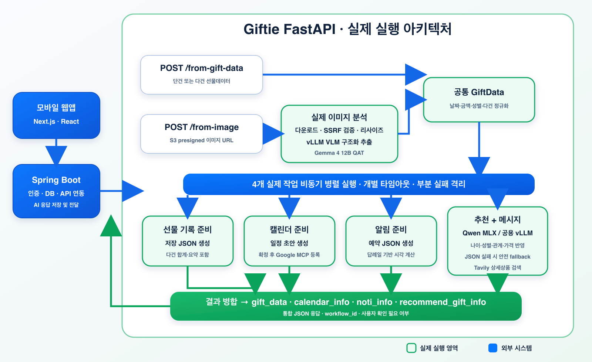
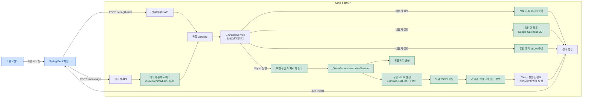

# Giftie AI Service

Giftie의 FastAPI 기반 AI 오케스트레이터입니다. Spring Boot 백엔드에서 선물데이터 또는 S3 이미지 주소를 받아 다음 네 작업을 비동기로 실행한 뒤 하나의 JSON으로 반환합니다.

1. 선물 기록 저장 데이터 준비 — 실제 실행
2. Google MCP 캘린더 등록 — 실제 실행 (토큰이 없으면 등록용 초안까지)
3. 알림 예약 데이터 준비 — 실제 실행
4. 추천 상품 및 감사 메시지 준비 — 실제 실행

추천과 이미지 분석은 **같은 vLLM 서버의 같은 모델(Gemma4-12B-QAT + MTP)** 을 씁니다.
GPU 한 장에 모델을 두 벌 올리지 않으므로 메모리와 기동 시간이 절약되고, vLLM 의 연속 배칭
덕분에 두 종류의 요청이 동시에 들어와도 한 엔진에서 함께 처리됩니다.

## 현재 구현 범위

공개 업무 API는 준비용 두 개와 확정용 한 개입니다.

| Method | Path | 입력 | 처리 |
|---|---|---|---|
| POST | `/api/v1/agent/from-gift-data` | 구조화된 선물데이터 | 네 작업을 바로 실행 |
| POST | `/api/v1/agent/from-image` | S3 이미지 URL | 이미지 분석 후 네 작업 실행 |
| POST | `/api/v1/agent/confirm` | 사용자 수정본 | 확정하고 캘린더에 실제 등록 |
| POST | `/api/v1/agent/recommend` | 나이·가격대·카테고리·성별 | 추천만 단독 실행 |

앞의 두 API는 **캘린더에 등록하지 않고 초안까지만** 만듭니다. 잘못 추출된 일정이
사용자 캘린더에 바로 박히면 되돌리기 어렵기 때문입니다. 실제 등록은 사용자가 확인 화면에서
검토·수정한 뒤 `/confirm`에서 일어납니다.

네 작업 모두 실제 구현이 들어가 있습니다.

- **이미지 분석**: presigned URL 다운로드 → 검증·리사이즈 → vLLM(Gemma4-12B-QAT) 구조화 출력 → `GiftData`
- **선물 기록**: `GiftData` 원본 필드를 유지한 채 저장용 파생 필드를 덧붙인 JSON
- **캘린더**: `GOOGLE_ACCESS_TOKEN` 이 있으면 자체 MCP 서버를 통해 Google Calendar 에 실제 등록,
  없으면 등록용 초안 JSON 까지만 생성
- **알림**: 캘린더와 같은 규칙에서 나온 시각으로 예약 JSON 생성

`MODEL_BACKEND=mock` 이면 네트워크를 타지 않고 고정된 결과로 흐름만 확인할 수 있습니다.

## 처리 흐름

### 전체 아키텍처



위 그림은 외부 시스템부터 네 개의 최상위 병렬 작업, Qwen 추천 내부의
Tavily 실상품 검색, 최종 JSON 병합까지의 전체 요청 흐름을 보여줍니다.
아래 Mermaid 다이어그램은 클래스와 서비스 간 연결을 확인하기 위한 상세
기술 구조입니다.

### 상세 기술 구조



- 초록색: 실제로 실행되는 영역
- 파란색: Giftie 외부 시스템

이미지 분석과 추천은 그림의 `Model` 노드, 즉 **같은 vLLM 엔진 하나**를 공유합니다.

### 요청 실행 순서

```text
선물데이터 요청 ──────────────────────────┐
                                         ├─> 공통 GiftData
이미지 URL 요청 -> 이미지 분석 ───────────┘
                                                 │
          ┌──────────────────┬───────────────────┼───────────────────┐
          │                  │                   │                   │
          ▼                  ▼                   ▼                   ▼
 선물 기록 JSON       캘린더 JSON        알림 JSON       추천 + 메시지
          │                  │                   │                   │
          │                  │                   │                   ▼
          │                  │                   │          카테고리별 Tavily 검색
          │                  │                   │                   │
          └──────────────────┴──────────┼────────┴───────────────────┘
                                        │
                                        ▼
                                  4개 작업 결과 병합
                                        │
                                        ▼
                                  최종 JSON 응답
```

선물 기록, 캘린더, 알림, Qwen 추천·메시지의 네 작업은 공통
`GiftData`가 준비되는 즉시 `asyncio.gather(..., return_exceptions=True)`로
동시에 시작합니다. Qwen 추천 작업 안에서는 모델이 검색어와 카테고리를 만든
다음 카테고리별 Tavily 검색을 다시 병렬로 실행합니다. 네 작업 중 하나가
실패해도 나머지 결과는 유지하며, 실패한 항목만 `ERROR` 상태로 반환합니다.
각 최상위 작업에는 `REQUEST_TIMEOUT_SECONDS` 제한 시간이 적용됩니다.

### 확정 단계

```text
[준비]  POST /from-image  ->  네 작업 동시 실행  ->  응답(requires_confirmation=true)
                                                          |
                                              사용자가 확인 화면에서 검토·수정
                                              (금액 정정, 저장할 건 선택, 일정 변경)
                                                          |
[확정]  POST /confirm  ->  기록·알림 재계산 + Google Calendar 등록  ->  응답
```

AI 서비스는 **상태를 보관하지 않습니다.** 백엔드가 준비 응답을 들고 있다가 사용자 수정본과 함께
`/confirm`으로 되돌려주면 됩니다. 세션을 AI 쪽에 두면 재시작이나 인스턴스 증설에서 그대로 깨지는데,
확정에 필요한 데이터는 어차피 백엔드가 DB에 저장할 것들입니다.

## 프로젝트 구조

```text
AI-Service/
├── app/
│   ├── core/
│   │   ├── config.py             # 환경변수 및 모델 설정
│   │   └── security.py           # X-API-KEY 검증
│   ├── routers/
│   │   └── agent.py              # 공개 API 두 개
│   ├── schemas/
│   │   ├── agent.py              # API 요청·응답 타입 (공개 계약, GiftRecordItem/CalendarDraft 포함)
│   │   ├── recommendation.py     # 추천 입력·출력 타입
│   │   └── vision.py             # 이미지 추출 내부 타입 (HTTP 로 나가지 않음)
│   ├── services/
│   │   ├── gift_agent_service.py # 실행·타임아웃·결과 병합만 담당
│   │   ├── model_response_parser.py # 모델 JSON 응답 파싱
│   │   ├── prompt.py             # 추천 프롬프트 + 강제 JSON 스키마
│   │   ├── recommendation_policy.py # 가격·카테고리 안전 정책
│   │   ├── qwen_service.py       # 추론 (vllm / mlx / transformers / mock)
│   │   ├── image_loader.py       # presigned URL 다운로드·검증·리사이즈
│   │   ├── vision_prompt.py      # 이미지 추출 프롬프트 + 강제 JSON 스키마
│   │   ├── vlm_service.py        # vLLM 이미지 추출 호출
│   │   ├── vision_response_parser.py # VLM 출력 정규화 (날짜·금액·중복)
│   │   ├── gift_data_policy.py   # 추출 결과 -> GiftData 안전 변환
│   │   ├── reciprocity_schedule.py # 답례일·준비일·알림 시각 규칙
│   │   ├── record_summary.py     # 여러 건을 사람이 읽는 문구로 요약
│   │   ├── confirmation_service.py # 사용자 승인 이후의 확정 처리
│   │   ├── calendar_mcp_client.py # Google Calendar MCP 클라이언트
│   │   └── tasks/
│   │       ├── image_analysis.py # [담당 1] 이미지 -> 선물데이터
│   │       ├── gift_record.py   # [담당 2] 선물 기록 JSON
│   │       ├── calendar.py       # [담당 3] Google MCP 캘린더
│   │       ├── notification.py   # [담당 4] 알림 예약 JSON
│   │       └── recommendation.py # 추천·메시지
│   └── main.py                   # FastAPI 진입점
├── mcp_servers/
│   └── google_calendar.py        # 자체 Google Calendar MCP 서버 (별도 프로세스)
├── tests/
│   ├── test_agent.py
│   ├── test_image_analysis.py    # presigned URL -> GiftData 종단
│   ├── test_vision_response_parser.py
│   ├── test_gift_data_policy.py
│   ├── test_tasks.py             # 기록·캘린더·알림
│   ├── test_calendar_mcp.py      # MCP 인메모리 왕복
│   ├── test_confirmation.py      # 승인·확정 흐름, 다건 선택
│   ├── test_recommendation_integration.py # 추천 통합(스키마·가격·역할)
│   └── test_vllm_backend.py      # 추천이 같은 엔진을 쓰는지
├── .env.example
├── .gitignore
├── Dockerfile
└── requirements*.txt
```

## 환경 설정

`.env.example`을 복사해 사용합니다.

```bash
cp .env.example .env
```

| 변수 | 설명 | 로컬 예시 |
|---|---|---|
| `API_KEY` | Spring Boot와 공유하는 내부 API 키 | `local-development-key` |
| `MODEL_BACKEND` | `mock`, `vllm`, `mlx`, `transformers` | `mock` |
| `LOCAL_MODEL_ID` | Apple Silicon MLX 모델 | `mlx-community/Qwen3-4B-Instruct-2507-4bit` |
| `MODEL_ID` | GPU Transformers 모델 | `Qwen/Qwen3-4B` |
| `PRELOAD_MODEL` | 서버 시작 시 모델 사전 적재 여부 | `false` |
| `MAX_NEW_TOKENS` | 모델 최대 생성 토큰 | `600` |
| `REQUEST_TIMEOUT_SECONDS` | 각 비동기 작업 제한 시간 | `45` |
| `PRODUCT_SEARCH_PROVIDER` | 실제 상품 검색 제공자, `auto`, `disabled` 또는 `tavily` | `auto` |
| `TAVILY_API_KEY` | Tavily 상품 웹 검색 API 키 | 빈 값 |
| `PRODUCT_SEARCH_TIMEOUT_SECONDS` | 상품 검색 제한 시간 | `8` |

이미지 분석과 캘린더에 필요한 설정입니다.

| 변수 | 설명 | 로컬 예시 |
|---|---|---|
| `VLLM_BASE_URL` | 공용 vLLM 서버 주소. FastAPI 가 8000 을 쓰므로 8001 로 띄웁니다 | `http://localhost:8001` |
| `VLLM_MODEL` | vLLM `--served-model-name` 값 | `gemma4-12b-qat` |
| `VLLM_TIMEOUT_SECONDS` | vLLM 호출 제한 시간 | `90` |
| `VISION_MAX_NEW_TOKENS` | 이미지 추출 최대 생성 토큰 | `900` |
| `IMAGE_MAX_EDGE` | 이미지 장변 리사이즈 상한(px) | `1280` |
| `IMAGE_MAX_BYTES` | 허용 이미지 최대 크기 | `12582912` |
| `STRICT_PRICE` | 금액을 못 읽었을 때 `true` 면 502, `false` 면 추정가로 채움 | `false` |
| `CALENDAR_MCP_URL` | Google Calendar MCP 서버 주소 | `http://localhost:8300/mcp` |
| `GOOGLE_ACCESS_TOKEN` | 사용자 Google OAuth access token. 비우면 초안만 생성 | (비움) |
| `GOOGLE_CALENDAR_ID` | 대상 캘린더 | `primary` |
| `CALENDAR_DEFAULT_LEAD_DAYS` | `target_date` 가 없을 때 답례일까지의 기본 간격(일) | `30` |
| `NOTIFICATION_LEAD_DAYS` | 답례일 며칠 전에 알릴지 | `7` |

`.env`에는 비밀값이 들어가므로 Git에 커밋하지 않습니다.

실제 상품 링크를 응답에 포함하려면 다음 값을 추가합니다. 키가 없거나 검색이
실패하면 API 전체를 실패시키지 않고 `products: []`와 기존
`product_examples`를 반환합니다.

```env
# 생략하거나 auto로 두면 TAVILY_API_KEY 존재 시 자동 활성화됩니다.
PRODUCT_SEARCH_PROVIDER=auto
TAVILY_API_KEY=tvly-발급받은-키
```

## Apple Silicon Mac 실행

현재 Mac 로컬 개발은 vLLM이 아니라 MLX를 사용합니다.

```bash
cd /Users/parksteve/Desktop/AI_Hackerton/AI-Service
python3 -m venv .venv-runtime
source .venv-runtime/bin/activate
pip install -r requirements-mac.txt
uvicorn app.main:app --host 127.0.0.1 --port 8000
```

최초 Qwen 요청에서 약 2.3GB 모델을 내려받습니다. 이후에는 Hugging Face 로컬 캐시를 재사용합니다.

- Swagger: http://127.0.0.1:8000/docs
- OpenAPI JSON: http://127.0.0.1:8000/openapi.json

## Mock 모드 실행

모델 다운로드 없이 API 흐름만 테스트할 때 사용합니다.

```env
MODEL_BACKEND=mock
```

```bash
python3 -m venv .venv
source .venv/bin/activate
python3.12 -m venv .venv
source .venv/bin/activate
pip install -r requirements-dev.txt
uvicorn app.main:app --reload --port 8000
```

## vLLM 엔진 실행

추천과 이미지 분석이 **함께 쓰는 서버**입니다. FastAPI 가 8000 을 쓰므로 8001 로 띄웁니다.

```bash
docker run --rm --gpus all -p 8001:8000 \
  -v ~/.cache/huggingface:/root/.cache/huggingface --ipc=host \
  vllm/vllm-openai:v0.27.1-x86_64-cu129 \
  --model google/gemma-4-12B-it-qat-w4a16-ct \
  --served-model-name gemma4-12b-qat \
  --max-model-len 16384 --gpu-memory-utilization 0.90 \
  --limit-mm-per-prompt '{"image": 2}'
```

```env
MODEL_BACKEND=vllm
VLLM_BASE_URL=http://localhost:8001
VLLM_MODEL=gemma4-12b-qat
```

MTP(Multi-Token Prediction)를 켜더라도 OpenAI 호환 API 는 그대로이므로 **이 서비스 코드는 바뀌지 않습니다.**
서버 기동 플래그만 달라집니다.

`MODEL_BACKEND` 가 `mlx` 나 `transformers` 인 경우(Mac 로컬 개발) 이미지 분석은 자동으로 mock 으로
떨어지고 경고 로그를 남깁니다. 두 백엔드 모두 텍스트 전용이라 이미지를 볼 수 없기 때문입니다.

## Google Calendar MCP 서버 실행

캘린더 등록은 `mcp_servers/google_calendar.py` 가 노출하는 MCP 툴을 통해 이뤄집니다.
별도 프로세스로 띄웁니다.

```bash
python -m mcp_servers.google_calendar     # streamable-http, :8300/mcp
```

노출하는 툴은 `create_event`, `update_event`, `get_event`, `delete_event`, `list_events`
다섯 가지이고, 모두 **사용자별 `access_token` 을 인자로 받습니다.**

공개된 Google Calendar MCP 서버 대부분은 서버 자신이 OAuth 플로우를 돌리고 토큰 파일 하나로
단일 계정만 다룹니다. Giftie 는 Spring Security 가 보유한 사용자별 토큰을 써야 하므로
그 구조로는 다중 사용자를 받을 수 없어 직접 만들었습니다. 토큰은 로그에 남기지 않습니다.

필요한 OAuth 스코프는 `https://www.googleapis.com/auth/calendar.events` 입니다.

실제 Google 계정으로 연동을 확인하려면 `.env` 에 `GOOGLE_ACCESS_TOKEN` 을 넣고 다음을 실행합니다.
생성 → 조회 → 알림 확인 → 승인 후 등록 → 삭제 순으로 돌기 때문에 캘린더에 흔적이 남지 않습니다.

```bash
python scripts/verify_calendar.py
```

일정을 **종일이 아니라 시간 지정으로 만드는 이유**가 여기서 확인됩니다. Google 의
`reminders.overrides.minutes` 는 0 이상만 허용하고 시작 시각 기준으로 거슬러 올라갑니다.
종일 일정은 시작이 자정이라 "당일 오전 알림"을 표현할 수 없습니다. 시간 지정 일정이라
`[0, 1440]`(정각, 하루 전) 알림이 실제로 걸립니다.

`GOOGLE_ACCESS_TOKEN` 이 비어 있으면 캘린더 작업은 등록을 시도하지 않고 초안 JSON 까지만 만듭니다.
MCP 서버가 죽어 있어도 캘린더 작업은 `ERROR` 가 아니라 초안과 `registerError` 를 함께 돌려주므로
나머지 세 작업 결과는 그대로 유지됩니다.

## 인증

두 API는 `X-API-KEY` 헤더가 필요합니다.

```http
X-API-KEY: local-development-key
```

키가 없거나 틀리면 `401 Unauthorized`를 반환합니다. 운영에서는 프론트엔드가 아니라 Spring Boot만 이 키를 보유하고 FastAPI를 호출해야 합니다.

## API 1: 선물데이터 직접 전달

```http
POST /api/v1/agent/from-gift-data
```

```bash
curl -X POST http://127.0.0.1:8000/api/v1/agent/from-gift-data \
  -H 'Content-Type: application/json' \
  -H 'X-API-KEY: local-development-key' \
  -d '{
    "gift_data": {
      "gift_name": "스타벅스 케이크",
      "gift_price": 35000,
      "age": 29,
      "gender": "female",
      "person_name": "김민수",
      "relationship": "친구",
      "received_at": "2026-08-19",
      "target_date": "2026-09-10"
    }
  }'
```

### 선물데이터 필드

| 필드 | 타입 | 필수 | 설명 |
|---|---|---|---|
| `gift_name` | string | O | 받은 선물 이름, 1~200자 |
| `gift_price` | integer | O | 받은 선물 가격, 1~100,000,000원 |
| `age` | integer/null | X | 상대방 나이, 0~120 |
| `gender` | string/null | X | 답례 받을 상대의 성별, `male` 또는 `female`. 모르면 생략/null |
| `person_name` | string/null | X | 상대방 이름 |
| `relationship` | string/null | X | 상대방과의 관계 |
| `received_at` | date/null | X | 받은 날짜 |
| `target_date` | date/null | X | 답례 예정일 |

날짜는 정상적인 `YYYY-MM-DD`만 사용합니다. `""`, `null`, 형식이 잘못된 문자열은 오류로 처리하지 않고 모두 미입력(`null`)으로 정규화합니다. 성별도 생략·`""`·`null`·`unknown`이면 미입력으로 처리하며, 값이 있을 때만 나이와 함께 추천에 반영합니다. `target_date`가 없으면 캘린더는 오늘부터 30일 뒤, 알림은 그 날짜의 7일 전 오전 10시를 사용합니다.

## API 2: 이미지 전달

```http
POST /api/v1/agent/from-image
```

```bash
curl -X POST http://127.0.0.1:8000/api/v1/agent/from-image \
  -H 'Content-Type: application/json' \
  -H 'X-API-KEY: local-development-key' \
  -d '{
    "image_url": "https://example-bucket.s3.amazonaws.com/gift.png"
  }'
```

`ImageAnalysisService.analyze(image_url: str) -> GiftData` 는 다음 순서로 동작합니다.

1. **다운로드** — presigned URL 로 이미지를 받습니다. 스킴이 http(s) 가 아니거나 사설·루프백
   주소면 거부하고(SSRF 방어), `IMAGE_MAX_BYTES` 를 넘으면 중단합니다.
2. **정규화** — 장변을 `IMAGE_MAX_EDGE`(기본 1280px)로 줄이고 PNG 로 다시 인코딩합니다.
   JPEG 가 아니라 PNG 인 이유는 스크린샷의 작은 글자가 JPEG 압축에서 뭉개지면 추출 정확도가
   그대로 떨어지기 때문입니다.
3. **추출** — vLLM 에 `response_format: json_schema` 로 구조화 출력을 강제해 기록 배열을 받습니다.
4. **정규화·선택** — 날짜·금액 표기를 정리하고, 영수증의 할인·합계 줄과 중복 건을 걸러낸 뒤
   대표 1건을 `GiftData` 로 만듭니다.

presigned URL 을 vLLM 에 그대로 넘기지 않는 이유는 세 가지입니다. vLLM 컨테이너가 S3 에 닿는다는
보장이 없고, 다운로드 크기와 제한 시간을 통제할 수 없으며, 리다이렉트를 타고 내부망으로 향하는
요청을 막을 수 없습니다.

비공개 S3 객체는 다음 중 하나가 필요합니다.

- Spring Boot가 유효기간이 짧은 presigned URL 전달
- 이미지 분석 서비스 IAM 역할에 해당 S3 객체 읽기 권한 부여

## API 3: 확정

```http
POST /api/v1/agent/confirm
```

```bash
curl -X POST http://127.0.0.1:8000/api/v1/agent/confirm \
  -H 'Content-Type: application/json' \
  -H 'X-API-KEY: local-development-key' \
  -d '{
    "workflow_id": "3d3f9780-...",
    "gift_data": { ...준비 응답의 gift_data.payload에 사용자 수정을 반영한 것... },
    "calendar":  { ...준비 응답의 calendar_info.payload에 사용자 수정을 반영한 것... },
    "approved": true,
    "register_calendar": true,
    "google_access_token": "ya29...."
  }'
```

| 필드 | 필수 | 설명 |
|---|---|---|
| `workflow_id` | O | 준비 응답의 값을 그대로 |
| `gift_data` | O | 사용자가 수정한 기록. `records[].selected`로 저장할 건을 고릅니다 |
| `calendar` | X | 사용자가 수정한 일정. **생략하면 수정된 `gift_data`로 다시 계산합니다** |
| `approved` | X | `false`면 아무것도 등록하지 않습니다 (기본 `true`) |
| `register_calendar` | X | `false`면 초안만 확정하고 등록은 건너뜁니다 (기본 `true`) |
| `google_access_token` | X | 사용자 Google OAuth access token. 없으면 서버 설정값 사용 |

응답의 `calendar_info.payload`에 `registered: true`, `eventId`, `htmlLink`가 채워집니다.
등록에 실패해도 HTTP는 `200`이며 `registered: false`와 `registerError`가 함께 옵니다.
캘린더가 막혔다고 기록과 알림까지 잃을 이유는 없기 때문입니다.

## 최종 응답

준비 단계(`/from-image`, `/from-gift-data`)의 실제 응답입니다.
`requires_confirmation: true` 이고 `calendar_info.payload.registered` 는 `false` 입니다.
`/confirm` 을 거치면 `provider` 가 `GOOGLE_MCP` 로 바뀌고 `registered: true` 와 함께
`eventId`, `htmlLink` 가 채워집니다.

```json
{
  "gift_data": {
    "status": "READY",
    "payload": {
      "gift_name": "스타벅스 케이크",
      "gift_price": 35000,
      "age": 29,
      "person_name": "김민수",
      "relationship": "대학 동기",
      "received_at": "2026-08-19",
      "target_date": "2026-09-10",
      "records": [],
      "record_type": "gift",
      "direction": "received",
      "price_basis": "stated",
      "event": null,
      "event_date": null,
      "confidence": 1.0,
      "needs_review": false,
      "review_reasons": [],
      "workflowId": "9f1c...",
      "currency": "KRW",
      "summary": "김민수님에게 받은 스타벅스 케이크 (35,000원)",
      "recordCount": 1,
      "receivedCount": 1,
      "totalAmount": 35000,
      "recordedAt": "2026-08-19T14:59:20",
      "resolvedTargetDate": "2026-09-10",
      "targetDateEstimated": false
    }
  },
  "calendar_info": {
    "status": "READY",
    "payload": {
      "provider": "GOOGLE_MCP_DRAFT",
      "registered": false,
      "workflowId": "9f1c...",
      "title": "김민수님 답례 준비",
      "description": "김민수님에게 받은 스타벅스 케이크 (35,000원)에 대한 답례를 준비할 시간입니다.\n받은 날: 2026-08-19\n관계: 대학 동기\n답례 예정일: 2026-09-10",
      "date": "2026-09-03",
      "startTime": "10:00",
      "durationMinutes": 30,
      "timezone": "Asia/Seoul",
      "remindersMinutes": [
        0,
        1440
      ],
      "calendarId": "primary",
      "targetDate": "2026-09-10"
    }
  },
  "noti_info": {
    "status": "READY",
    "payload": {
      "workflowId": "9f1c...",
      "timezone": "Asia/Seoul",
      "notifications": [
        {
          "type": "RECIPROCITY_PREPARE",
          "channel": "WEB",
          "title": "답례 선물을 준비할 시간이에요",
          "body": "김민수님에게 받은 스타벅스 케이크, 기억하고 계시죠? 2026-09-10까지 답례를 준비해 보세요.",
          "scheduledAt": "2026-09-03T10:00:00",
          "deepLink": "/records/9f1c...",
          "recipientCount": 1
        }
      ],
      "title": "답례 선물을 준비할 시간이에요",
      "scheduledAt": "2026-09-03T10:00:00"
    }
  },
  "recommend_gift_info": {
    "status": "READY",
    "recommend_gift": {
      "input_gift_name": "스타벅스 케이크",
      "input_gift_price": 35000,
      "input_age": 29,
      "recommended_price_min": 28000,
      "recommended_price_max": 42000,
      "categories": [
        {
          "category": "식품·디저트",
          "score": 95,
          "reason": "케이크를 선물로 받았으므로 비슷한 카테고리의 고급 디저트로 답례하는 것이 가장 자연스럽습니다.",
          "product_examples": [
            "프리미엄 디저트 세트",
            "제철 과일 세트"
          ]
        }
      ],
      "summary": "스타벅스 케이크(35,000원)를 받았으므로, 비슷한 예산 범위 내에서 정성스러운 디저트나 …",
      "model": "gemma4-12b-qat",
      "source": "GEMMA_VLLM"
    },
    "message": {
      "tone": "따뜻하고 구체적이며 부담 없는 말투",
      "content": "김민수님, 지난번에 선물해 주신 스타벅스 케이크 정말 고마웠어요. 늘 대학 동기로서 따뜻하게 챙겨주시는 마음 …",
      "generated_by": "GEMMA_VLLM"
    }
  },
  "workflow_id": "9f1c...",
  "requires_confirmation": true
}
```

`products`는 Tavily가 찾은 결과 중 허용된 쇼핑 도메인의 **개별 상품 상세페이지**만
포함합니다. 검색 결과·카테고리·기획전·기사 페이지는 사용자에게 실제 상품을 보여 주는
것이 아니므로 제외합니다. 상품 제목이 추천 카테고리와 의미상 관련된 경우만 통과시키고,
모바일/PC 주소가 달라도 같은 상품 ID면 하나로 합칩니다. 가격 범위 안 상품을 우선하며,
범위 안 상품이 전혀 없을 때만 가장 가까운 가격의 상세상품 하나를 대안으로 반환합니다.
검색 키가 없거나 관련 상세상품이 없거나 검색이 실패하면 `products`는 빈 배열이 되며,
`product_examples`는 항상 안전한 대체 추천으로 유지됩니다. `age`에 `0`,
`"0"`, 빈 문자열 또는 `null`을 보내면 나이 정보가 없는 것으로 처리하며,
최종 응답에서는 값이 `null`인 선택 필드가 생략될 수 있습니다.

부분 실패 시 HTTP 응답 자체는 `200`이며 실패한 작업만 다음처럼 표시됩니다.

```json
{
  "status": "ERROR",
  "error": "캘린더 준비 중 오류가 발생했습니다."
}
```

선물데이터 생성 자체가 실패하거나 이미지 분석이 실패하면 네 작업을 시작할 수 없으므로 `422` 또는 `502`를 반환합니다.

## 주요 함수 시그니처

### 담당별 구현 현황

`gift_agent_service.py`는 실행 순서만 담당하므로 각 기능을 구현할 때 수정하지 않는 것이 원칙입니다.
아래 네 파일 모두 **함수 이름과 입력·출력 타입을 바꾸지 않고 내부만 구현**했습니다.
`schemas/agent.py`의 `GiftData` 계약은 그대로입니다.

| 담당 작업 | 파일 | 유지된 메서드 계약 | 상태 |
|---|---|---|---|
| 이미지 추출·분석 | `app/services/tasks/image_analysis.py` | `analyze(str) -> GiftData` | 구현 |
| 선물 기록 JSON | `app/services/tasks/gift_record.py` | `prepare(GiftData, str) -> PreparedData` | 구현 |
| Google MCP 캘린더 | `app/services/tasks/calendar.py` | `prepare(GiftData, str) -> PreparedData` | 구현 |
| 알림 예약 JSON | `app/services/tasks/notification.py` | `prepare(GiftData, str) -> PreparedData` | 구현 |

```python
# 이미지 URL -> 공통 선물데이터
async def analyze(image_url: str) -> GiftData

# 선물 기록 저장 요청 데이터
async def prepare(gift_data: GiftData, workflow_id: str) -> PreparedData

# Google MCP 캘린더 등록 초안 (등록은 /confirm 에서)
async def prepare(gift_data: GiftData, workflow_id: str) -> PreparedData

# 알림 예약 데이터
async def prepare(gift_data: GiftData, workflow_id: str) -> PreparedData

# 추천과 메시지
async def prepare(gift_data: GiftData) -> GiftRecommendationInfo

# 동기 추론: 호출 측에서 asyncio.to_thread 로 실행
def recommend_simple(
    request: SimpleGiftRecommendationRequest,
) -> SimpleGiftRecommendationResponse

# 사용자 승인 이후의 확정
async def confirm(request: ConfirmRequest) -> ConfirmResponse
```

#### 여러 건이 들어 있는 이미지

계좌 거래내역 5건, 선물함 목록 4건, 영수증 3품목처럼 이미지 한 장에 여러 건이 있는 경우를
모두 다룹니다. `GiftData`의 기존 평면 필드는 **대표 1건**(받은 금액이 가장 큰 건)을 그대로 담고,
전체는 `records` 배열에 들어갑니다. 기존 필드는 손대지 않았으므로 이를 모르는 코드도 그대로 동작합니다.

```json
{
  "gift_name": "축의금", "gift_price": 200000, "person_name": "최은비",
  "records": [
    {"record_id": "r0", "person_name": "김도윤", "price": 100000, "direction": "received", "selected": true},
    {"record_id": "r1", "person_name": "박서준", "price":  50000, "direction": "received", "selected": true},
    {"record_id": "r2", "person_name": "최은비", "price": 200000, "direction": "received", "selected": true},
    {"record_id": "r3", "person_name": "카카오페이", "price": 38900, "direction": "sent", "selected": true}
  ],
  "recordCount": 4, "receivedCount": 3, "totalAmount": 350000,
  "summary": "김도윤님 외 2명에게 받은 축의금 (총 350,000원)"
}
```

- `recordCount`는 저장할 기록 수, `receivedCount`는 답례 대상 수입니다. 거래내역의 출금 건은
  기록으로는 남기되 답례 대상과 금액 합계에서는 빠집니다.
- `selected`를 `false`로 바꿔 `/confirm`에 보내면 그 건은 저장·합계·명단에서 제외됩니다.
- 캘린더 일정은 건마다 만들지 않고 **하나로 묶습니다.** 축의금 4건을 받았다고 캘린더에 일정이
  4개 뜨면 오히려 방해가 되므로, 대상자 명단은 일정 설명에 담습니다.

#### 금액을 읽을 수 없는 경우

청첩장처럼 금액이 아예 없는 이미지도 502로 실패시키지 않습니다.

- `gift_price`는 1 이상이 필수이므로 카테고리별 추정가를 넣고 `price_basis`를 `estimated`로 표시하며
  `gift_name`에 `(금액 미상)`을 붙입니다.
- 다만 `records` 안의 해당 항목은 `price: null`을 그대로 유지하므로 **"금액을 못 읽었다"는 사실이
  사라지지 않습니다.** 사용자가 확인 화면에서 직접 넣으면 됩니다.
- `STRICT_PRICE=true`로 두면 추정하지 않고 502를 반환합니다.

#### 확인이 필요한 항목

모델 신뢰도가 낮거나 이름·날짜·금액을 읽지 못한 항목은 `needs_review: true`와 `review_reasons`가
붙어 나옵니다. 확인 화면에서 해당 행을 강조해 사용자 확인을 유도하면 됩니다.

### 추천 통합

추천도 이미지 분석과 **같은 vLLM 서버의 같은 모델**을 쓰며, 같은 방식으로 구조화 출력을 강제합니다.

- **카테고리 enum 강제**: 프롬프트와 `response_format` 스키마가 `ALLOWED_CATEGORIES` 하나를
  공유합니다. 각자 목록을 들고 있으면 반드시 어긋나고, 모델이 목록 밖 값을 만들 수 없게 됩니다.
- **가격 범위**: 한 건이면 받은 금액의 80~120%. 여러 사람에게 받았다면 **각 금액의 최저 80%부터
  최고 120%까지** 넓힙니다. 5만원 준 사람과 20만원 준 사람에게 같은 가격대를 권하면
  한쪽에는 과하고 다른 쪽에는 모자랍니다.
- **역할 구분**: `record_type`이 `event_invitation`이면 "사용자는 초대받은 하객이며 주인공이
  아니다"를 프롬프트에 명시합니다. 이 안내가 없으면 모델이 사용자를 신랑신부 쪽으로 착각해
  하객에게 감사하는 문장을 씁니다.
- **기본 문구 분기**: 모델 메시지가 너무 짧으면 템플릿으로 대체하는데, 이 템플릿도 종류별로
  나뉩니다. 청첩장에 "선물해 주신 청첩장 고마웠어요"라고 쓰면 어색하고, 여러 사람에게 받았는데
  한 사람 이름을 넣으면 나머지에게는 쓸 수 없습니다.

### 실제 상품 검색

Tavily 로 **신뢰할 수 있는 국내 거래 플랫폼에서만** 검색해 실제 상품명·판매가·구매 링크를 붙입니다.
쿠팡, 카카오 선물하기, 네이버 쇼핑, SSG, G마켓, 11번가, 롯데온, 컬리, 올리브영으로 제한합니다.
제한하지 않으면 블로그·카페의 광고성 글이 상위를 채웁니다.

**모델에게 검색 툴을 쥐어 주지 않습니다.** 모델은 카테고리와 가격 범위까지만 정하고 검색은
파이프라인이 결정론적으로 부릅니다. 12B 급 모델의 tool calling 신뢰성에 기대지 않아도 되고,
호출 횟수가 고정이라 지연을 예측할 수 있습니다. 검색이 실패해도 카테고리 추천과 메시지는 그대로 나갑니다.

**실제 상품 링크는 반드시 개별 상품 상세페이지여야 합니다.** 링크를 눌렀을 때 특정 상품의
가격·옵션·구매 버튼이 바로 보여야 하며, 쇼핑몰 검색 결과나 카테고리 목록으로 이동하는 URL은
상품 추천으로 인정하지 않습니다. 적합한 상세페이지가 없으면 무관한 링크로 개수를 채우지 않고
빈 배열을 반환합니다.

**판매가는 검색 스니펫이 아니라 상품 페이지에서 확인합니다.** 스니펫의 숫자는 같은 브랜드의
다른 옵션 가격일 수 있습니다. 실측에서 `gift.kakao.com/product/2198213` 의 실제 판매가는
39,000원이었는데 스니펫에는 32,000 / 15,000 / 23,000 만 있고 39,000 은 없었습니다.
그래서 Tavily Extract 로 본문의 "판매가 N원" 을 읽고, 확인된 값만 `price_verified: true` 로 표시합니다.

실측에서 얻은 운영 지식입니다.

| 사실 | 대응 |
|---|---|
| `country` 파라미터를 `include_domains` 와 함께 쓰면 결과가 0건 | `country` 를 보내지 않음 |
| `extract_depth: basic` 은 국내 쇼핑몰 상당수를 못 읽음 | `advanced` 사용 |
| 접근이 막힌 URL 하나가 재시도로 묶음 전체를 늦춤(8건 12초 초과) | 3건씩 나눠 동시 호출 |
| 검색·목록 페이지는 실제 상품이 아님 | 최종 후보에서 완전히 제외 |
| 검색어 가격 힌트를 상한으로 주면 비싼 것만 나옴 | 범위 중앙값 사용 |
| 모바일/PC URL이 달라 같은 상품이 중복됨 | 플랫폼 상품 ID 기준으로 중복 제거 |
| 검색 스니펫에 검색어가 섞여 무관한 상품이 통과함 | 상품 제목을 카테고리 핵심어로 검증 |

**한계**: Tavily 는 쇼핑 API 가 아니라 범용 웹 검색이라 가격대로 결과를 거를 수 없습니다.
가격은 사후에 확인합니다. 범위 안 상품이 있으면 범위 밖 상품은 버리고, 범위 안 상품이 하나도
없을 때만 가격 차이가 가장 작은 상세상품 하나를 반환합니다. 범위를 벗어난 대안은
`rationale.warnings`와 상품별 `reason`에 명시됩니다.
구조화된 쇼핑 API(네이버 쇼핑, 쿠팡 파트너스)를 쓰면 이 한계가 사라집니다.

### 추천 근거

`recommend_gift.rationale` 에 왜 그런 추천이 나왔는지가 담깁니다. 카테고리별 이유는 모델이 쓰지만
이 값들은 **규칙에서 결정론적으로** 나오므로 사용자에게 그대로 보여 줘도 됩니다.

```json
{
  "price_range_basis": "사용자가 지정한 예산(30,000원 ~ 50,000원)을 그대로 따랐습니다.",
  "inputs_used": ["나이 29세", "성별 여성", "사용자 지정 예산", "사용자 지정 카테고리 화장품·스킨케어"],
  "category_basis": "사용자가 고른 카테고리 안에서만 골랐습니다: 뷰티·화장품",
  "product_basis": "11번가, 카카오 선물하기에서 찾았습니다. 3개 중 3개는 상품 페이지에서 판매가를 확인했고, 2개가 30,000원 ~ 50,000원 안에 듭니다.",
  "warnings": ["1개는 제안 가격대를 벗어납니다."]
}
```

`inputs_used` 에는 **실제로 반영된 입력만** 들어갑니다. 나이를 안 줬으면 나이가 나오지 않습니다.
없는 근거를 있는 것처럼 보이면 안 되기 때문입니다.

## 백엔드 연동 테스트

백엔드 담당자가 이 서비스를 호출해 보는 방법입니다. **실제 모델·실제 검색·실제 캘린더**로 돕니다.

### 1. AI 서버 쪽에서 스택을 띄웁니다 (GPU 있는 머신)

```bash
./scripts/run_e2e_stack.sh          # vLLM(:8001) + Calendar MCP(:8300) + AI Service(:8000)
./scripts/run_e2e_stack.sh --status # 상태 확인
./scripts/run_e2e_stack.sh --stop   # 종료
```

vLLM 모델 적재와 컴파일에 2~3분 걸립니다. 다 뜨면 접속 주소와 API 키를 출력합니다.

### 2. 백엔드에서 호출합니다

같은 네트워크면 그 머신의 IP 로 바로 호출하면 됩니다. 다른 네트워크면 터널을 하나 열면 됩니다.

```bash
# AI 서버 쪽에서 (둘 중 하나)
cloudflared tunnel --url http://localhost:8000
ngrok http 8000
```

Spring Boot 설정:

```env
AI_SERVICE_URL=http://<AI-서버-주소>:8000
AI_SERVICE_API_KEY=<.env 의 API_KEY 와 같은 값>
```

HTTP 타임아웃은 **90초 이상**으로 잡아 주세요. 이미지 분석 + 추천 + 상품 검색까지 도는
`/from-image` 가 실측에서 10~20초이고, vLLM 이 방금 떴을 때는 더 걸립니다.

### 3. 요청 예시

`docs/api-examples.http` 를 IntelliJ 나 VS Code(REST Client)에서 열면 실행 버튼으로 바로 호출됩니다.
인증 실패(401)와 검증 실패(422) 확인용 요청도 들어 있습니다.

### 4. 계약 문서

- Swagger: `http://<AI-서버-주소>:8000/docs`
- OpenAPI 스펙 파일: `docs/openapi.json` (Java 클라이언트 생성에 쓸 수 있습니다)

스펙 파일은 코드에서 뽑습니다. 계약을 바꾸면 다시 뽑아 주세요.

```bash
python scripts/export_openapi.py          # 갱신
python scripts/export_openapi.py --check  # 코드와 다르면 종료코드 1 (CI 용)
```

### 모델 없이 흐름만 확인하고 싶다면

GPU 가 없거나 응답을 고정하고 싶을 때는 mock 으로 띄웁니다. **요청·응답 형태는 완전히 동일**하고
AI 응답만 고정값입니다.

```bash
docker compose up --build   # :8000 AI Service, :8300 Calendar MCP
```

### 연동할 때 알아 둘 것

- **`/from-image` 와 `/from-gift-data` 는 캘린더에 등록하지 않습니다.** 초안까지만 만들고
  `requires_confirmation: true` 로 표시합니다. 실제 등록은 사용자 승인 후 `/confirm` 에서만 일어납니다.
- **이 서비스는 상태를 보관하지 않습니다.** 백엔드가 준비 응답을 들고 있다가 사용자 수정본과 함께
  `/confirm` 으로 되돌려주면 됩니다.
- **부분 실패는 200 입니다.** 캘린더 등록이 실패해도 기록·알림·추천은 그대로 나가고
  `calendar_info.payload.registerError` 에 사유가 담깁니다. 네 작업 중 하나가 죽어도
  그 항목만 `status: "ERROR"` 이고 나머지는 유지됩니다.
- **Google access token 은 `/confirm` 요청 본문에 실어 주세요.** 사용자별 토큰이므로
  서버 설정값이 아니라 요청마다 달라야 합니다.

## 테스트

```bash
cd /Users/parksteve/Desktop/AI_Hackerton/AI-Service
source .venv-runtime/bin/activate
pytest -q
```

테스트 범위:

- Swagger에 공개 업무 API가 정확히 두 개인지 확인
- 선물데이터 입력과 이미지 입력
- API 키 누락
- 빈 값/null/잘못된 날짜 정규화
- 비동기 작업 하나 실패 시 부분 결과 보존
- presigned URL 다운로드부터 `GiftData`까지 종단 (S3·vLLM 은 respx 로 가로챔)
- 날짜·금액 표기 정규화, 영수증 할인·합계 줄 제거, 중복 제거
- 다건 이미지에서 대표 1건 선택, 금액 미상 추정가 정책
- 답례일·준비일·알림 시각 규칙, 캘린더와 알림 날짜 일치
- Google Calendar MCP 인메모리 왕복 (종일 일정 배타적 종료일, 알림 분 범위)
- 추천이 이미지 분석과 같은 vLLM 엔드포인트를 쓰는지
- 준비 단계가 캘린더에 등록하지 않고, /confirm 에서만 등록하는지
- 사용자 수정(금액 정정·건 제외·일정 변경)이 기록·캘린더·알림에 일관되게 반영되는지
- 추천 프롬프트와 강제 스키마가 같은 카테고리 목록을 쓰는지
- 여러 사람에게 받았을 때 가격 범위가 최저~최고를 모두 감당하는지
- 청첩장에서 사용자를 하객으로 다루는지

모든 테스트는 vLLM·S3·Google 없이 돕니다.

## GPU 서버 실행

```env
MODEL_BACKEND=vllm
VLLM_BASE_URL=http://vllm:8000
VLLM_MODEL=gemma4-12b-qat
CALENDAR_MCP_URL=http://calendar-mcp:8300/mcp
API_KEY=운영용-긴-비밀키
```

```bash
docker build -t giftie-ai .
docker run --rm -p 8000:8000 --env-file .env giftie-ai
```

`MODEL_BACKEND=vllm` 이면 이 컨테이너는 모델을 적재하지 않으므로 `--gpus` 도, `PRELOAD_MODEL` 도
필요 없습니다. GPU 는 vLLM 컨테이너 하나만 씁니다.

`transformers` 백엔드로 모델을 이 프로세스에 직접 올리는 경우에는 GPU 하나당 Uvicorn worker를
하나만 실행해야 합니다. worker를 늘리면 각 프로세스가 모델을 별도로 적재해 GPU 메모리를
중복 사용합니다. Docker 헬스체크는 현재 존재하는 `/openapi.json`을 사용합니다.

## Spring Boot 연동

```text
프론트엔드
    |
    | 사용자 인증
    v
Spring Boot
    |
    | X-API-KEY
    v
Giftie FastAPI
```

Spring Boot 설정 예:

```env
AI_SERVICE_URL=http://giftie-ai:8000
AI_SERVICE_API_KEY=FastAPI의-API_KEY와-같은-값
```

Spring Boot는 다음 두 주소 중 입력에 맞는 하나를 호출합니다.

- `POST {AI_SERVICE_URL}/api/v1/agent/from-gift-data`
- `POST {AI_SERVICE_URL}/api/v1/agent/from-image`

HTTP 타임아웃은 모델 최초 적재 시간을 고려해 개발 환경에서 90초 이상, 모델이 미리 적재되는 운영 환경에서는 서비스 정책에 맞게 설정하는 것을 권장합니다.
