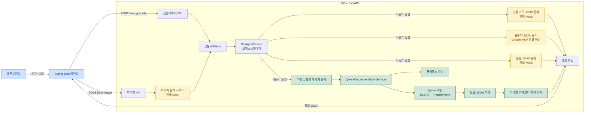

# Giftie AI Service

Giftie의 FastAPI 기반 AI 오케스트레이터입니다. Spring Boot 백엔드에서 선물데이터 또는 S3 이미지 주소를 받아 다음 네 작업을 비동기로 실행한 뒤 하나의 JSON으로 반환합니다.

1. 선물 기록 저장 데이터 준비 — mock
2. Google MCP 캘린더 등록 데이터 준비 — mock
3. 알림 예약 데이터 준비 — mock
4. Qwen 추천 상품 및 감사 메시지 준비 — 실제 실행

## 현재 구현 범위

공개 업무 API는 두 개뿐입니다.

| Method | Path | 입력 | 처리 |
|---|---|---|---|
| POST | `/api/v1/agent/from-gift-data` | 구조화된 선물데이터 | 네 작업을 바로 실행 |
| POST | `/api/v1/agent/from-image` | S3 이미지 URL | 이미지 분석 후 네 작업 실행 |

이미지 분석 함수는 현재 mock입니다. 선물 기록, 캘린더, 알림 함수도 담당 기능을 연결하기 위한 함수 시그니처와 mock JSON만 제공합니다. 추천 상품과 메시지는 로컬 MLX Qwen 또는 서버용 Transformers Qwen으로 실제 생성합니다.

## 처리 흐름

### 전체 아키텍처



- 노란색: 다른 담당자가 실제 구현으로 교체할 mock 영역
- 초록색: 현재 실제로 실행되는 Qwen 추천 영역
- 파란색: Giftie 외부 시스템

### 요청 실행 순서

```text
선물데이터 요청 ──────────────────────────┐
                                         ├─> 공통 GiftData
이미지 URL 요청 -> 이미지 분석(mock) ─────┘
                                                 │
                 ┌───────────────────────────────┼───────────────────────────────┐
                 │                               │                               │
                 ▼                               ▼                               ▼
        선물 기록 JSON(mock)          캘린더 JSON(mock)              알림 JSON(mock)
                 │                               │                               │
                 └───────────────────────────────┼───────────────────────────────┘
                                                 │
                                                 ▼
                                      Qwen 추천 + 메시지(실제)
                                                 │
                                                 ▼
                                           최종 JSON 응답
```

네 작업은 `asyncio.gather(..., return_exceptions=True)`로 동시에 시작합니다. 한 작업이 실패해도 나머지 작업 결과는 유지하며, 실패한 항목만 `ERROR` 상태로 반환합니다. 각 작업에는 `REQUEST_TIMEOUT_SECONDS` 제한 시간이 적용됩니다.

## 프로젝트 구조

```text
AI-Service/
├── app/
│   ├── core/
│   │   ├── config.py             # 환경변수 및 모델 설정
│   │   └── security.py           # X-API-KEY 검증
│   ├── routers/
│   │   └── agent.py              # 공개 API 두 개
│   ├── schemas/
│   │   ├── agent.py              # API 요청·응답 타입
│   │   └── recommendation.py     # Qwen 입력·출력 타입
│   ├── services/
│   │   ├── gift_agent_service.py # 실행·타임아웃·결과 병합만 담당
│   │   ├── model_response_parser.py # 모델 JSON 응답 파싱
│   │   ├── prompt.py             # Qwen 프롬프트
│   │   ├── recommendation_policy.py # 가격·카테고리 안전 정책
│   │   ├── qwen_service.py       # MLX/Transformers 추론
│   │   └── tasks/
│   │       ├── image_analysis.py # [담당 1] 이미지 -> 선물데이터
│   │       ├── gift_record.py   # [담당 2] 선물 기록 JSON
│   │       ├── calendar.py       # [담당 3] Google MCP 캘린더
│   │       ├── notification.py   # [담당 4] 알림 예약 JSON
│   │       └── recommendation.py # 실제 Qwen 추천·메시지
│   └── main.py                   # FastAPI 진입점
├── tests/
│   └── test_agent.py
├── .env.example
├── .gitignore
├── Dockerfile
└── requirements*.txt
```

## 환경 설정

`.env.example`을 복사해 사용합니다.

```bash
cp .env.example .env
```

| 변수 | 설명 | 로컬 예시 |
|---|---|---|
| `API_KEY` | Spring Boot와 공유하는 내부 API 키 | `local-development-key` |
| `MODEL_BACKEND` | `mock`, `mlx`, `transformers` | `mlx` |
| `LOCAL_MODEL_ID` | Apple Silicon MLX 모델 | `mlx-community/Qwen3-4B-Instruct-2507-4bit` |
| `MODEL_ID` | GPU Transformers 모델 | `Qwen/Qwen3-4B` |
| `PRELOAD_MODEL` | 서버 시작 시 모델 사전 적재 여부 | `false` |
| `MAX_NEW_TOKENS` | 모델 최대 생성 토큰 | `600` |
| `REQUEST_TIMEOUT_SECONDS` | 각 비동기 작업 제한 시간 | `45` |

`.env`에는 비밀값이 들어가므로 Git에 커밋하지 않습니다.

## Apple Silicon Mac 실행

현재 Mac 로컬 개발은 vLLM이 아니라 MLX를 사용합니다.

```bash
cd /Users/parksteve/Desktop/AI_Hackerton/AI-Service
python3 -m venv .venv-runtime
source .venv-runtime/bin/activate
pip install -r requirements-mac.txt
uvicorn app.main:app --host 127.0.0.1 --port 8000
```

최초 Qwen 요청에서 약 2.3GB 모델을 내려받습니다. 이후에는 Hugging Face 로컬 캐시를 재사용합니다.

- Swagger: http://127.0.0.1:8000/docs
- OpenAPI JSON: http://127.0.0.1:8000/openapi.json

## Mock 모드 실행

모델 다운로드 없이 API 흐름만 테스트할 때 사용합니다.

```env
MODEL_BACKEND=mock
```

```bash
python3 -m venv .venv
source .venv/bin/activate
pip install -r requirements.txt
uvicorn app.main:app --reload --port 8000
```

## 인증

두 API는 `X-API-KEY` 헤더가 필요합니다.

```http
X-API-KEY: local-development-key
```

키가 없거나 틀리면 `401 Unauthorized`를 반환합니다. 운영에서는 프론트엔드가 아니라 Spring Boot만 이 키를 보유하고 FastAPI를 호출해야 합니다.

## API 1: 선물데이터 직접 전달

```http
POST /api/v1/agent/from-gift-data
```

```bash
curl -X POST http://127.0.0.1:8000/api/v1/agent/from-gift-data \
  -H 'Content-Type: application/json' \
  -H 'X-API-KEY: local-development-key' \
  -d '{
    "gift_data": {
      "gift_name": "스타벅스 케이크",
      "gift_price": 35000,
      "age": 29,
      "person_name": "김민수",
      "relationship": "친구",
      "received_at": "2026-08-19",
      "target_date": "2026-09-10"
    }
  }'
```

### 선물데이터 필드

| 필드 | 타입 | 필수 | 설명 |
|---|---|---|---|
| `gift_name` | string | O | 받은 선물 이름, 1~200자 |
| `gift_price` | integer | O | 받은 선물 가격, 1~100,000,000원 |
| `age` | integer/null | X | 상대방 나이, 0~120 |
| `person_name` | string/null | X | 상대방 이름 |
| `relationship` | string/null | X | 상대방과의 관계 |
| `received_at` | date/null | X | 받은 날짜 |
| `target_date` | date/null | X | 답례 예정일 |

날짜는 정상적인 `YYYY-MM-DD`만 사용합니다. `""`, `null`, 형식이 잘못된 문자열은 오류로 처리하지 않고 모두 미입력(`null`)으로 정규화합니다. `target_date`가 없으면 캘린더는 오늘부터 30일 뒤, 알림은 그 날짜의 7일 전 오전 10시를 사용합니다.

## API 2: 이미지 전달

```http
POST /api/v1/agent/from-image
```

```bash
curl -X POST http://127.0.0.1:8000/api/v1/agent/from-image \
  -H 'Content-Type: application/json' \
  -H 'X-API-KEY: local-development-key' \
  -d '{
    "image_url": "https://example-bucket.s3.amazonaws.com/gift.png"
  }'
```

현재 `ImageAnalysisService.analyze(image_url: str) -> GiftData`는 테스트용 선물명과 가격을 반환합니다. 이미지 분석 담당자는 동일한 함수 시그니처를 유지한 채 내부를 실제 S3/비전 모델 호출로 교체하면 됩니다.

비공개 S3 객체는 다음 중 하나가 필요합니다.

- Spring Boot가 유효기간이 짧은 presigned URL 전달
- 이미지 분석 서비스 IAM 역할에 해당 S3 객체 읽기 권한 부여

## 최종 응답

```json
{
  "gift_data": {
    "status": "READY",
    "payload": {}
  },
  "calendar_info": {
    "status": "READY",
    "payload": {}
  },
  "noti_info": {
    "status": "READY",
    "payload": {}
  },
  "recommend_gift_info": {
    "status": "READY",
    "recommend_gift": {
      "recommended_price_min": 28000,
      "recommended_price_max": 42000,
      "categories": []
    },
    "message": {
      "tone": "따뜻하고 구체적이며 부담 없는 말투",
      "content": "김민수님, 지난번에 선물해 주신 케이크 정말 고마웠어요. 세심하게 챙겨주신 마음이 느껴져서 선물을 받을 때부터 기분이 참 좋았어요. 덕분에 잘 즐기고 있고 볼 때마다 감사한 마음이 들어요. 저도 그 마음을 기억하고 작은 정성을 준비했으니 부담 없이 기쁘게 받아주세요!",
      "generated_by": "QWEN_MLX"
    }
  }
}
```

부분 실패 시 HTTP 응답 자체는 `200`이며 실패한 작업만 다음처럼 표시됩니다.

```json
{
  "status": "ERROR",
  "error": "캘린더 준비 중 오류가 발생했습니다."
}
```

선물데이터 생성 자체가 실패하거나 이미지 분석이 실패하면 네 작업을 시작할 수 없으므로 `422` 또는 `502`를 반환합니다.

## 주요 함수 시그니처

### 팀원이 수정할 파일

아래 네 파일에서 `IMPLEMENTATION POINT`를 검색하면 실제로 교체할 위치가 바로 나옵니다. `gift_agent_service.py`는 실행 순서만 담당하므로 각 기능을 구현할 때 수정하지 않는 것이 원칙입니다.

| 담당 작업 | 수정할 파일 | 유지할 메서드 계약 |
|---|---|---|
| 이미지 추출·분석 | `app/services/tasks/image_analysis.py` | `analyze(str) -> GiftData` |
| 선물 기록 JSON | `app/services/tasks/gift_record.py` | `prepare(GiftData, str) -> PreparedData` |
| Google MCP 캘린더 | `app/services/tasks/calendar.py` | `prepare(GiftData, str) -> PreparedData` |
| 알림 예약 JSON | `app/services/tasks/notification.py` | `prepare(GiftData, str) -> PreparedData` |

각 담당자는 함수 이름과 입력·출력 타입을 바꾸지 않고 함수 내부만 구현하는 것을 권장합니다. 계약을 변경해야 한다면 `schemas/agent.py`, 테스트, Spring Boot DTO를 함께 변경해야 합니다.

```python
# 이미지 URL -> 공통 선물데이터(mock)
async def analyze(image_url: str) -> GiftData

# 선물 기록 저장 요청 데이터(mock)
async def prepare(
    gift_data: GiftData,
    workflow_id: str,
) -> PreparedData

# Google MCP 캘린더 등록 데이터(mock)
async def prepare(
    gift_data: GiftData,
    workflow_id: str,
) -> PreparedData

# 알림 예약 데이터(mock)
async def prepare(
    gift_data: GiftData,
    workflow_id: str,
) -> PreparedData

# Qwen 추천과 메시지(실제)
async def prepare(
    gift_data: GiftData,
) -> GiftRecommendationInfo

# Qwen 동기 추론: 호출 측에서 asyncio.to_thread로 실행
def recommend_simple(
    request: SimpleGiftRecommendationRequest,
) -> SimpleGiftRecommendationResponse
```

## 테스트

```bash
cd /Users/parksteve/Desktop/AI_Hackerton/AI-Service
source .venv-runtime/bin/activate
pytest -q
```

테스트 범위:

- Swagger에 공개 업무 API가 정확히 두 개인지 확인
- 선물데이터 입력과 이미지 입력
- API 키 누락
- 빈 값/null/잘못된 날짜 정규화
- 비동기 작업 하나 실패 시 부분 결과 보존

## GPU 서버 실행

```env
MODEL_BACKEND=transformers
MODEL_ID=Qwen/Qwen3-4B
PRELOAD_MODEL=true
API_KEY=운영용-긴-비밀키
```

```bash
docker build -t giftie-ai .
docker run --gpus all --rm -p 8000:8000 --env-file .env giftie-ai
```

GPU 하나에서는 Uvicorn worker를 하나만 실행해야 합니다. worker를 늘리면 각 프로세스가 모델을 별도로 적재해 GPU 메모리를 중복 사용합니다. Docker 헬스체크는 현재 존재하는 `/openapi.json`을 사용합니다.

## Spring Boot 연동

```text
프론트엔드
    |
    | 사용자 인증
    v
Spring Boot
    |
    | X-API-KEY
    v
Giftie FastAPI
```

Spring Boot 설정 예:

```env
AI_SERVICE_URL=http://giftie-ai:8000
AI_SERVICE_API_KEY=FastAPI의-API_KEY와-같은-값
```

Spring Boot는 다음 두 주소 중 입력에 맞는 하나를 호출합니다.

- `POST {AI_SERVICE_URL}/api/v1/agent/from-gift-data`
- `POST {AI_SERVICE_URL}/api/v1/agent/from-image`

HTTP 타임아웃은 모델 최초 적재 시간을 고려해 개발 환경에서 90초 이상, 모델이 미리 적재되는 운영 환경에서는 서비스 정책에 맞게 설정하는 것을 권장합니다.
